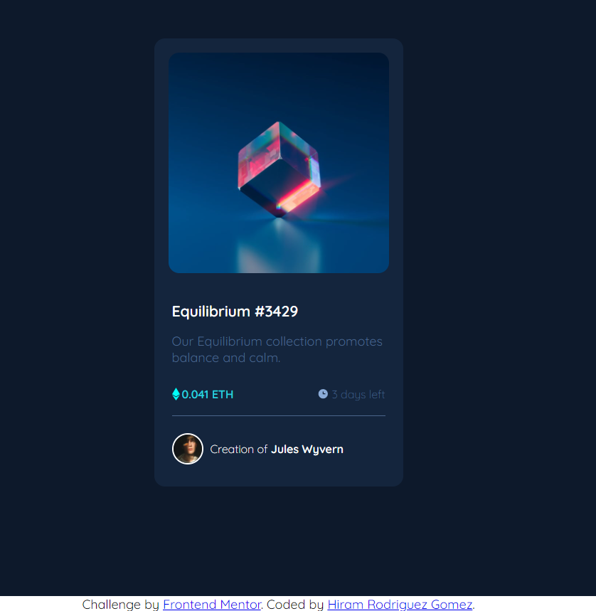

# Frontend Mentor - NFT preview card component solution

This is a solution to the [NFT preview card component challenge on Frontend Mentor](https://www.frontendmentor.io/challenges/nft-preview-card-component-SbdUL_w0U). Frontend Mentor challenges help you improve your coding skills by building realistic projects. 

## Table of contents

- [Overview](#overview)
  - [The challenge](#the-challenge)
  - [Screenshot](#screenshot)
  - [Links](#links)
- [My process](#my-process)
  - [Built with](#built-with)
  - [What I learned](#what-i-learned)
  - [Continued development](#continued-development)
  - [Useful resources](#useful-resources)
- [Author](#author)
- [Acknowledgments](#acknowledgments)

## Overview

Project to practice HTML and CSS, creating a Card to preview a NFT element

### The challenge

Users should be able to:

- View the optimal layout depending on their device's screen size
- See hover states for interactive elements

### Screenshot




### Links

- Solution URL: [Solution](https://your-solution-url.com)
- Live Site URL: [Add live site URL here](https://your-live-site-url.com)

## My process

### Built with

- Semantic HTML5 markup
- CSS custom properties
- Flexbox
- CSS Grid


### What I learned

This project helped me to deepen my understanding about CSS style, mainly in element positioning.

I learned about the Pseudoselectors and the syntasis tu use them to define more specific and efficient selectors:
```css
.card-designer-text a:is(:link, :visited){
    color: var(--white);
}
```

### Continued development

I need to learn more about responsive design and techniques to make more professional webs (like Mobile First)

### Useful resources

- [CSS-Tricks PseudoSelector](https://css-tricks.com/almanac/selectors/i/is/) - This helped me to understand more about the pseudoselector :is and its syntaxis

## Author

- Frontend Mentor - [@hirogo25](https://www.frontendmentor.io/profile/hirogo25)
- GitHub - [@hirogo25](https://github.com/hirogo25)


## Acknowledgments

I want to thank to [Bit Crew](https://github.com/Bit-crew). His solution for this challenge was clear and helped me to realize the last details to improve the design (for example, the transition in elements that change with :hover state).